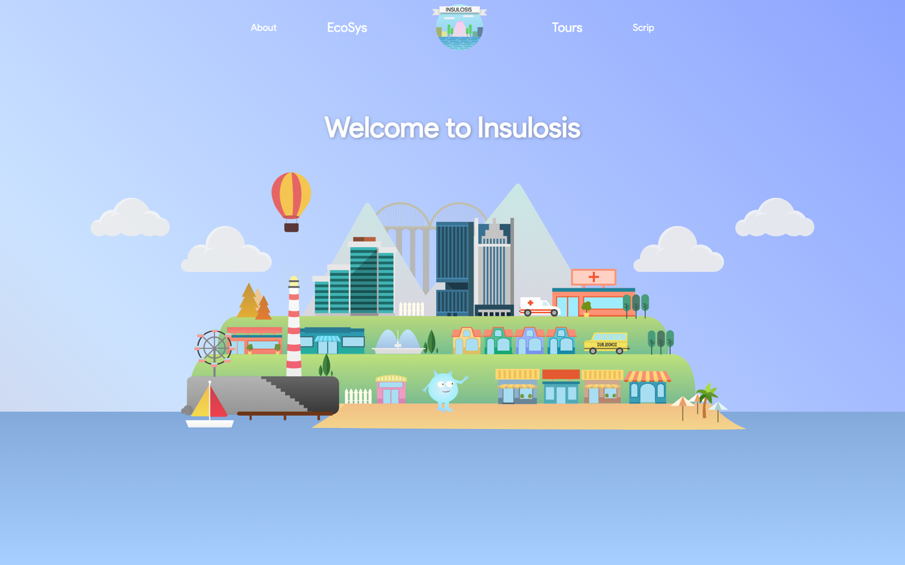
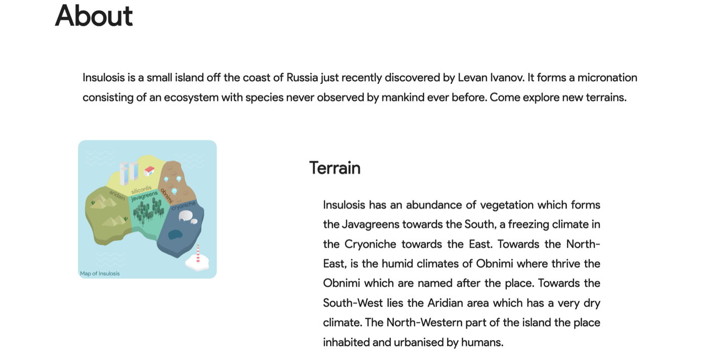
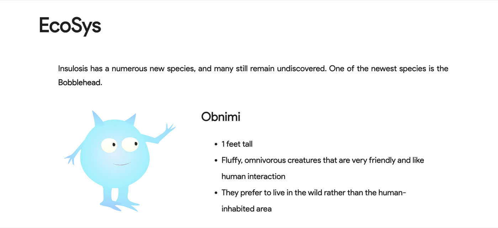
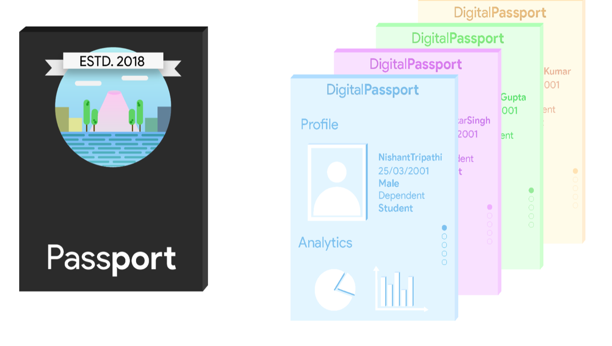
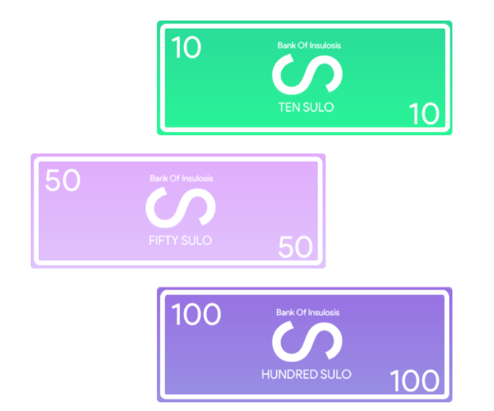

<h1 align="center">Insulosis</h1>

<p align="center">
  A micronation that doesn't exist — invented, branded, illustrated and shipped in three days<br>
  for the on-site build round of <b>Exun 2018</b>.
</p>

<p align="center">
  
</p>

<p align="center">
  <sub>Team <b>NODE</b> · DPS Gurgaon · October 2018 · Top 15 at Exun, DPS R.K. Puram</sub>
</p>

---

## The brief

Exun is the annual tech symposium of DPS R.K. Puram. **Build** is its hackathon: you get a theme, a room, a
deadline, and you have to hand over something finished at the end of it — website, graphics, and an A/V
piece, all of one world.

Ours was **Insulosis**: a newly discovered island off the Russian coast that had declared itself a
micronation. It needed a flag's worth of identity — a logo, a map, a native species, a passport, a
currency — and a site that made a made-up country feel like it had a tourism board.

We were one of the **top 15 teams** to qualify for the on-site round. It was the last hackathon the four of
us did as a school team.

## What we shipped

<table>
<tr><td width="50%">

**A country with a geography**

Five biomes, drawn as one isometric map: the forested Javagreens in the south, the frozen Cryoniche east, the humid Obnimi north-east, the dry Aridain south-west, and Siliconlis — the only part humans built on.

</td><td width="50%">

</td></tr>

<tr><td width="50%">

**A native species**

The *Obnimi* — one foot tall, fluffy, omnivorous, friendly, and firmly uninterested in living anywhere near people. Named after the region it comes from.

</td><td width="50%">

</td></tr>

<tr><td width="50%">

**Immigration**

A passport with a cover crest and four issued Digital Passport screens — one per team member — plus a working visa application form. Established 2018, naturally.

</td><td width="50%">

</td></tr>

<tr><td width="50%">

**An economy**

The **Sulo**, issued by the Bank of Insulosis, in denominations of 10, 50 and 100, pegged at 1 Sulo = 3 USD. There is also a form for paying your taxes, because a micronation is nothing without one.

</td><td width="50%">

</td></tr>
</table>

## Easter egg

Click the island on the landing page. It opens **FlappyBall**, a p5.js game we built on the side — first as a
Processing sketch (following the Coding Train's Coding Challenge #31), then ported to JavaScript so it could
live in the browser. Desktop only; we gated it above 650px.

```
source/Processing/CC_031_FlappyBird/   the original .pde sketch
source/P5/                             the port that actually ships
```

## How it's built

No framework, no build step, no `node_modules`. Four hand-written stylesheets, one jQuery file, and a folder
of SVGs we drew ourselves.

| | |
|---|---|
| **Markup** | A single `index.html` — five full-height sections on one scroll |
| **Styling** | `style.css`, `sections.css`, `navbar-mobile.css`, `forms.css`; Product Sans throughout |
| **Motion** | jQuery scroll handlers move clouds, balloon and island at different rates for parallax; the nav inverts from transparent-on-sky to solid white once you leave the hero |
| **Responsive** | The five-item split nav collapses into a hamburger drawer below 650px |
| **Forms** | Labels that slide out of the field on focus, done in CSS with a jQuery assist |
| **Game** | p5.js 0.6.1 |

## Repository layout

```
index.html                     the site
css/                           four stylesheets
js/script.js                   parallax, nav state, menu, form labels
source/                        every asset we made
├── Insulosis_Map.svg          the island map
├── landingIsland.svg          the isometric landing illustration
├── alien1.svg                 the Obnimi
├── Insulosis_Logo.png         emblem / favicon
├── Passport*.png|svg          passport cover and digital passport screens
├── {ten,fifty,hundred}sulo.png    currency
├── Cloud1-2.svg, balloon.svg  parallax layers
├── Product Sans *.ttf         the typeface
├── Exun 2018.zip              the Illustrator source files (.ai)
├── self produced exun build audio .mp3    original score for the A/V piece
└── PROGRESS.txt               our day-one status note to the judges
```

`Exun 2018.zip` is the part that isn't code: `MAP.ai`, `Landing.ai`, `Currency.ai`, `creature_boi.ai`,
`logo_emblem.ai`, `Passport_page.ai` and the poster — the whole identity as editable vector.

## Running it

Any static server will do. From the repo root:

```bash
python3 -m http.server 4173
```

Then open <http://localhost:4173>. Opening `index.html` directly works too, though the game's font path
expects to be served from the root.

## Notes from 2018

Left exactly as we handed it in — including a truncated sentence in the Scrip section and a form field
labelled `BLEH` that we never got back to. Deadlines are deadlines.

<p align="center"><sub>Made with 💚 by NODE</sub></p>
